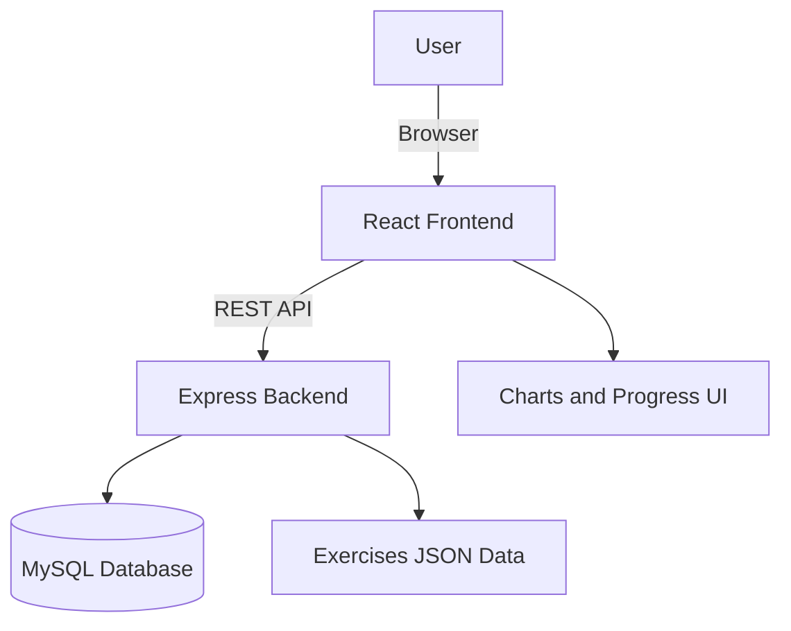
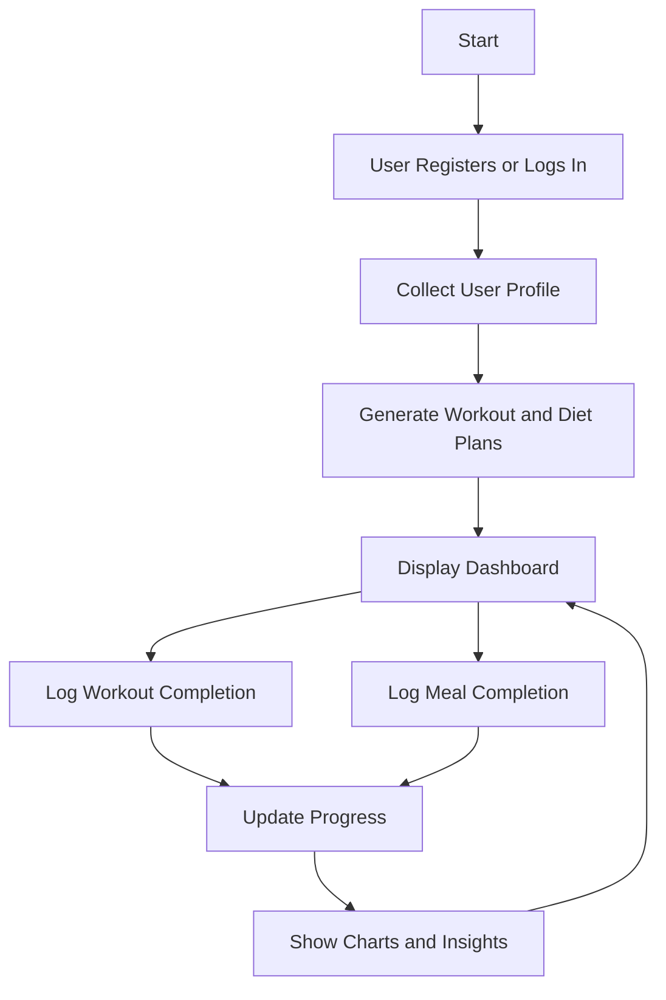

# FitPlan AI

FitPlan AI is a rule-based fitness and diet planner that delivers an AI-like personalized experience. It generates 10-week workout and nutrition plans, tracks daily completion, and supports cuisine and health modifiers. The project includes a React frontend and a Node.js/Express backend with a MySQL database.

## Problem Statement

Many users struggle to build consistent fitness and nutrition routines because existing tools are either too complex, expensive, or require long onboarding. The goal is to deliver a simple system that generates personalized plans, tracks progress, and adapts to user preferences without heavy friction.

## Project Abstract

FitPlan AI provides a rule-based personalization engine that converts user inputs into structured 10-week workout and diet plans. The system combines a React-based UI, an Express API, and a MySQL database for persistence. Users can register, receive personalized plans, log daily activity and meals, and visualize progress using charts.

## Objectives

- Generate personalized fitness and diet plans with weekly progression.
- Support dietary preferences, restrictions, and health conditions.
- Track workouts and meals with daily completion logs.
- Provide progress visualization for motivation and feedback.

## Features

- Personalized 10-week workout and diet plans
- Progressive training intensity by week
- Diet plans tailored to goals, cuisines, and restrictions
- Daily workout and meal completion tracking
- Progress dashboards with charting
- Responsive UI with light/dark theme support

## Tech Stack

- Frontend: React 18, Vite, React Router, Chart.js
- Backend: Node.js, Express, MySQL2, JWT
- Styling: CSS with custom properties

## Tools Used

- Visual Studio Code
- Node.js and npm
- Vite dev server
- MySQL
- Git

## Skills Used

- React component design and state management
- REST API design with Express
- Database schema design and SQL
- Authentication and secure storage (JWT)
- Data modeling for workouts and diets
- UI theming and responsive styling

## Monorepo Structure

```
Fitness-Plan-AI/
├── Backend/                 # Node/Express API and DB integration
│   ├── db.js                # MySQL connection pool
│   ├── schema.sql           # DB schema
│   ├── server.js            # Express app
│   └── routes/              # API routes
├── Frontend/                # React client
│   ├── src/
│   │   ├── components/      # Reusable UI components
│   │   ├── context/         # React context and state
│   │   ├── data/            # Rules and diet/workout data
│   │   ├── pages/           # App pages
│   │   ├── App.jsx          # App shell and routes
│   │   └── main.jsx         # Entry point
│   ├── index.html
│   └── package.json
├── exercises/               # Exercise metadata JSON files
└── README.md
```

## Prerequisites

- Node.js 16+ and npm
- MySQL 8+ (local or remote)

## Setup

### 1) Backend

1. Create a database and tables using [Backend/schema.sql](Backend/schema.sql).
2. In Backend, install dependencies:

```bash
cd Backend
npm install
```

3. Create a `.env` file in Backend:

```
DB_HOST=127.0.0.1
DB_USER=root
DB_PASSWORD=your_password
DB_NAME=fitness_db
PORT=5000
JWT_SECRET=your_secret
```

4. Start the API server:

```bash
npm start
```

### 2) Frontend

1. In Frontend, install dependencies:

```bash
cd Frontend
npm install
```

2. Start the Vite dev server:

```bash
npm run dev
```

3. Open `http://localhost:5173` in your browser.

## Usage Notes

- The API listens on `http://localhost:5000` by default.
- The frontend expects the backend to be running for auth, logs, and exercise lookups.
- Exercise details are served from the [exercises](exercises/) directory.

## Key Data Files

- Diet templates: [Frontend/src/data/diets.json](Frontend/src/data/diets.json)
- Workout templates: [Frontend/src/data/workouts.json](Frontend/src/data/workouts.json)
- Rule engine: [Frontend/src/data/rules.json](Frontend/src/data/rules.json)

## Scripts

Backend (from Backend/):

- `npm start` - Run the API server with nodemon

Frontend (from Frontend/):

- `npm run dev` - Start the dev server
- `npm run build` - Build for production
- `npm run preview` - Preview production build

## License

ISC

## System Architecture



## Application Flow

